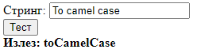

# Задача 10

Дадениот стринг да се претвори во Camel Case notation стринг.



```html
<!DOCTYPE html>
<html lang="en">
<head>
  <meta charset="UTF-8">
  <title>Задача 10</title>
</head>
<body>

<span>Стринг: </span><input type="text" id="in"><br>
<button onclick="convert()">Тест</button><br>
<b><span>Излез: </span><span id="izlez"></span></b>

<script>

  function convert() {
    let rechenica = document.getElementById("in").value;
    let izlezElem = document.getElementById("izlez");

    let zborovi = rechenica.split(" ");

    let camelCaseZborovi = zborovi.map((zbor, index) => {
      if (index === 0) {
        return zbor.toLowerCase(); // првиот збор започнува со мала буква
      } else {
        return zbor.charAt(0).toUpperCase() + zbor.slice(1).toLowerCase(); // првата буква се прави голема
      }
    });
    let camelCaseString = camelCaseZborovi.join("");

    izlezElem.innerText = camelCaseString;
  }

</script>

</body>
</html>
```