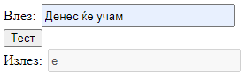
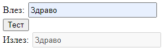

# Задача 2

Да се испечати првиот карактер кој се повторува повеќе пати и е различен од празно место во дадениот стринг.
Доколку нема таков да се испечати целиот стринг.





```html
<!doctype html>
<html lang="en">
<head>
  <meta charset="UTF-8" />
  <title>Задача 2</title>
  <style>
    input {
      width: 210px;
      height: 20px;
      margin: 2px;
    }
  </style>
</head>
<body>
<span>Влез: </span><input type="text" id="in" /><br />
<button onclick="find()">Тест</button>
<br />
<span>Излез: </span><input disabled id="izlez" />

<script>
  function find() {
    let input = document.getElementById("in").value;
    let izlezElem = document.getElementById("izlez");

    for (let i = 1; i < input.length; i++) {
      if (
          input.charAt(i) !== " " &&
          input.substring(0, i).includes(input.charAt(i))
      ) {
        // input.substring(0, i).includes(input.charAt(i)) - дали во продолжение на стрингот се појавува моменталниот карактер
        izlezElem.value = input.charAt(i);
        return;
      }
    }
    izlezElem.value = input;
  }
</script>
</body>
</html>
```
