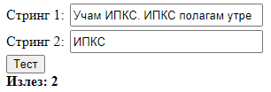
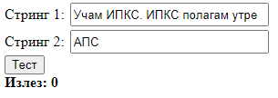

# Задача 3

Да се пребројат појавувањата на под-стринг во даден стринг, игнорирајќи ја големината на буквите.





```html
<!doctype html>
<html lang="en">
<head>
  <meta charset="UTF-8" />
  <title>Задача 3</title>
  <style>
    input {
      width: 210px;
      height: 20px;
      margin: 2px;
    }
  </style>
</head>
<body>
<span>Стринг 1: </span><input type="text" id="str1" /><br />
<span>Стринг 2: </span><input type="text" id="str2" /><br />
<button onclick="count()">Тест</button><br />
<b><span>Излез: </span><span id="izlez"></span></b>

<script>
  function count() {
    let str1 = document.getElementById("str1").value;
    let str2 = document.getElementById("str2").value;
    let izlelElem = document.getElementById("izlez");
    let delovi = [];

    delovi = str1.toLowerCase().split(str2.toLowerCase());
    console.log(delovi);
    // бараниот подстринг го дели стрингот на делови
    // Стр: Учам ИПКС. Утре се полага ИПКС во 13ч.
    // ПодСтр: ИПКС
    // delovi: ['учам ', '. утре се полага ', ' во 13ч.']
    izlelElem.innerText = delovi.length - 1;
  }
</script>
</body>
</html>
```
