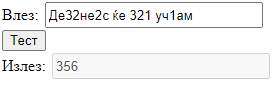
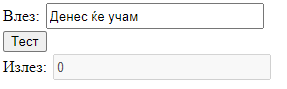

# Задача 5

Од дадениот стринг да се извлечат сите цифри и да се испечати нивниот збир.





```html
<!DOCTYPE html>
<html lang="en">
<head>
  <meta charset="UTF-8">
  <title>Задача 5</title>
  <style>
      input {
          width: 210px;
          height: 20px;
          margin: 2px;
      }
  </style>
</head>
<body>

<span>Влез: </span><input type="text" id="in"><br>
<button onclick="sum()">Тест</button><br>
<span>Излез: </span><input disabled id="izlez">

<script>

    function sum() {
        let input = document.getElementById("in").value;
        let izlezElem = document.getElementById("izlez");

        let broevi = []
        broevi = input.match(/\d+/g);
        // \d+ - означува една или повеќе цифри една по друга
        let sum = 0;
        if (broevi != null) {
            for (let broj of broevi) {
                sum += parseInt(broj);
            }
        }
        izlezElem.value = sum;
    }
  
</script>

</body>
</html>
```