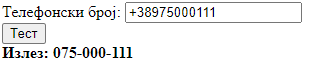

# Задача 6

Од даден македонски телефонски број да се отстрани повикувачкиот број и да се раздели со цртички.



```html
<!DOCTYPE html>
<html lang="en">
<head>
  <meta charset="UTF-8">
  <title>Задача 6</title>
</head>
<body>

<span>Телефонски број: </span><input type="text" id="number"><br>
<button onclick="convert()">Тест</button>
<br>
<b><span>Излез: </span><span id="izlez"></span></b>

<script>

    function convert() {
        let number = document.getElementById("number").value;
        let brojBezKod = "0" + number.substring(4);
        let izlezElem = document.getElementById("izlez");

        const formatiranBroj = brojBezKod.replace(/(\d{3})(\d{3})(\d{3})/, '$1-$2-$3');
        // со \d се таргетираат цифри, додека {3} укажува тоа да бидат 3 цифри
        izlezElem.innerText = formatiranBroj;
    }

</script>
</body>
</html>
```