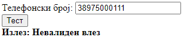

# Задача 6

Од даден македонски телефонски број да се отстрани повикувачкиот број и да се раздели со цртички. Притоа, пред да се изврши претворувањето, да се провери дали внесениот број е валиден (е во форматот +389dddddddd каде што "d" означува цифра).




```html
<!doctype html>
<html lang="en">
<head>
  <meta charset="UTF-8" />
  <title>Задача 6</title>
</head>
<body>
<span>Телефонски број: </span><input type="text" id="number" /><br />
<button onclick="convert()">Тест</button>
<br />
<b><span>Излез: </span><span id="izlez"></span></b>

<script>
  function convert() {
    let broj = document.getElementById("number").value;
    let izlezElem = document.getElementById("izlez");
    var validenVlezRegex = /^\+389\d{8}$/;
    // ^\+ - означува влезниот стринг да започнува со + (\ претставува escape character бидејќи + е специјален карактер при пишување regex)
    // 389 - после + треба да следи 389
    // \d{8}$ - после 389 треба да следат точно 8 цифри и со нив да завршува влезниот стринг
    if (!validenVlezRegex.test(broj)) {
      izlezElem.innerText = "Невалиден влез";
      return;
    }

    let brojBezKod = "0" + broj.substring(4);

    const formatiranBroj = brojBezKod.replace(
        /(\d{3})(\d{3})(\d{3})/,
        "$1-$2-$3",
    );
    // со \d се таргетираат цифри, додека {3} укажува тоа да бидат 3 цифри.
    izlezElem.innerText = formatiranBroj;
  }
</script>
</body>
</html>
```
