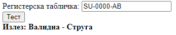

# Задача 7

Да се изврши валидација на дадената македонска регистарска таблица. Ако регистарската таблица е валидна, да се испечати [градот](https://mk.wikipedia.org/wiki/%D0%90%D0%B2%D1%82%D0%BE%D0%BC%D0%BE%D0%B1%D0%B8%D0%BB%D1%81%D0%BA%D0%B8_%D1%80%D0%B5%D0%B3%D0%B8%D1%81%D1%82%D0%B0%D1%80%D1%81%D0%BA%D0%B8_%D1%82%D0%B0%D0%B1%D0%BB%D0%B8%D1%87%D0%BA%D0%B8_%D0%B2%D0%BE_%D0%9C%D0%B0%D0%BA%D0%B5%D0%B4%D0%BE%D0%BD%D0%B8%D1%98%D0%B0) од каде што е регистарската таблица.




```html
<!doctype html>
<html lang="en">
<head>
  <meta charset="UTF-8" />
  <title>Задача 7</title>
</head>
<body>
<span>Регистерска табличка: </span><input type="text" id="tablica" /><br />
<button onclick="valid()">Тест</button>
<br />
<b><span>Излез: </span><span id="izlez"></span></b>

<script>
  gradoviOznaka = {
    BE: "Берово",
    BT: "Битола",
    DB: "Дебар",
    DE: "Делчево",
    DH: "Демир Хисар",
    DK: "Демир Капија",
    GE: "Гевгелија",
    GV: "Гостивар",
    KA: "Кавадарци",
    KI: "Кичево",
    KO: "Кочани",
    KR: "Кратово",
    KP: "Крива Паланка",
    KS: "Крушево",
    KU: "Куманово",
    MB: "Македонски Брод",
    MK: "Македонска Каменица",
    NE: "Неготино",
    OH: "Охрид",
    PP: "Прилеп",
    PE: "Пехчево",
    PS: "Пробиштип",
    RA: "Радовиш",
    RE: "Ресен",
    SK: "Скопје",
    SN: "Свети Николе",
    SR: "Струмица",
    ST: "Штип",
    SU: "Струга",
    TE: "Тетово",
    VA: "Валандово",
    VE: "Велес",
    VI: "Виница",
    VV: "Вевчани",
  };

  function proveriPochetniBukvi(del) {
    let grad = gradoviOznaka[del];

    return grad != null;
  }

  function proveriKrajniBukvi(del) {
    let regexBukvi = /^[A-Z]+$/;

    // regex кој проверува дали делот се состои само од букви
    return regexBukvi.test(del) && del.length === 2;
  }

  function proveriBrojki(del) {
    let regexBrojki = /^\d+$/;
    // regex кој проверува дали делот се состои само од бројки
    return regexBrojki.test(del) && del.length === 4;
  }

  function valid() {
    let tablica = document.getElementById("tablica").value;
    let izlezElem = document.getElementById("izlez");

    let delovi = tablica.toUpperCase().split("-");

    if (
        proveriPochetniBukvi(delovi[0]) &&
        proveriBrojki(delovi[1]) &&
        proveriKrajniBukvi(delovi[2])
    ) {
      izlezElem.innerText = "Валидна - " + gradoviOznaka[delovi[0]];
    } else {
      izlezElem.innerText = "Невалидна";
    }
  }
</script>
</body>
</html>
```
