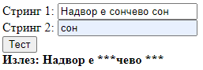

# Задача 8

Да се маскираат сите појавувања на вториот стринг во првиот стринг.



```html
<!DOCTYPE html>
<html lang="en">
<head>
  <meta charset="UTF-8">
  <title>Задача 8</title>
</head>
<body>

<span>Стринг 1: </span><input type="text" id="prvString"><br>
<span>Стринг 2: </span><input type="text" id="vtorString"><br>
<button onclick="mask()">Тест</button><br>
<b><span>Излез: </span><span id="izlez"></span></b>

<script>

    function mask() {
        let prv = document.getElementById("prvString").value;
        let vtor = document.getElementById("vtorString").value;
        let izlezElem = document.getElementById("izlez");

        izlezElem.innerText = prv.replaceAll(vtor, "*".repeat(vtor.length));
    }

</script>

</body>
</html>
```