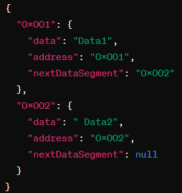

<h1>Вежба 2:</h1>

**Тополошко сортирање на несортирани податочни сегменти**

- **Тежина: 2/10**

**Преглед**: Во оваа вежба, ќе работите со JSON кој содржи несортирани податочни сегменти. Секој сегмент е претставен со JSON објект со полиња "data", "address" и "nextDataSegment". Задачата е визуелно тополошки да се сортираат овие податочни сегменти, така што првиот сегмент (без претходник) е поставен на почетокот, а секој сегмент е поврзан со неговиот наследник сѐ до последниот кој не е поврзан со ниту еден следен сегмент. Почетниот JSON не е тополошки сортиран, а HTML вклучува hard-code-ирана визуелна репрезентација на секој податочен сегмент, нивните поврзувања и потребниот CSS. Вашата цел е да ја имплементирате логиката за тополошко сортирање.

- **Инструкции**:
  - Добивање на несортираниот JSON **data-segments.json** кој содржи податочни сегменти со полињата "data", "address" и "nextDataSegment".

Пример за JSON:

- Имплементирајте ја логиката за тополошко сортирање за правилно поврзување на податочните сегменти.
- Визуелно прикажете ги сортираните податочни сегменти во дадениот HTML.

**Fetch From:**

**data-segments.json:** https://raw.githubusercontent.com/Itonkdong/JSON/main/data-segments.json

Слика 1. Успешно вчитани, сортирани и прикажани податочни сегменти

<h1>Exercise 2</h1> 

**Topological Sorting of Unsorted Data Segments**

- **Difficulty Level:** 2/10

**Overview:** In this exercise, you will work with a JSON containing unsorted data segments. Each segment is represented by a JSON object with fields "data," "address," and "nextDataSegment." The task is to visually topologically sort these data segments, where the first segment (without a predecessor) is placed at the beginning, and each segment is connected to its successor until the last one that is not linked to any subsequent segment. The initial JSON is not topologically sorted, and the HTML includes a hard-coded visual representation of each data segment, their connections, and all the necessary CSS. Your goal is to implement the logic for the topological sort.

- **Features:**
  - Fetch the unsorted JSON **data-segmenets.json** containing data segments with "data," "address," and "nextDataSegment" fields.
    - Example for the JSON:

- Implement the topological sort logic to correctly connect the data segments visually.
- Display the sorted data segments in the provided HTML, maintaining the specified connections.

**Fetch From:**

**data-segments.json:** https://raw.githubusercontent.com/Itonkdong/JSON/main/data-segments.json

