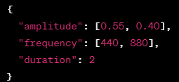

<h1>Вежба 5:</h1>

**Апликација за идентификација на песни** 

- **Тежина: 4/10** 

**Преглед**: Во оваа вежба, ќе ја истражите областа на аудио отпечатоците за креирање на поедноставена верзија на систем за идентификација на песни сличен на Shazam. Ќе ги пресметате уникатните отпечатоци за дадените делови од песната и ќе ги споредите со базата на песни за да ја идентификувате изворната песна. 

**Инструкции**:  

- За секој даден дел од песната, пресметајте го отпечатокот користејќи ги дадените амплитуда, фреквенција и времетраење.  
- Следете ги чекорите наведени подолу за пресметување на отпечатокот. 

**Создавање на отпечаток за даден дел од песната:**   

- 
- **Амплитуда**: Збирот на вредностите поделен со времетраењето (заокружен на 2 децимали). Пример: (0.55 + 0.40) / 2 = 0.475 
- **Фреквенција**: Збирот на вредностите поделен со времетраењето. Пример: (440 + 880) / 2 = 660.
- **Времетраење**: Користете го даденото времетраење. Пример: 2  
- **Создадете отпечаток за делот од песната**: Спојте ги пресметаните вредности со "\_". Пример: 0.475\_660\_2  
- Пристапете до JSON базата на песни, која содржи информации за различни песни, вклучувајќи наслови, уметници, времетраења, URL адреси за слики на кориците, и листи на отпечатоци за различни делови од секоја песна.  Користете ги генерираните отпечатоци за делови од песната за споредба и идентификација на песните од кои потекнуваат деловите.

**Што да се имплементира**:

1. **Споредба со база на песни:**  
- Прикажете ги сите пресметани отпечатоци во таб-от "Song Chunks".  
- Кликнете на отпечатокот на песната за да го ставите на местото за идентификација.  
- Кликнете на копчето "Shazamit" за да го идентификувате делот од песната со споредба со базата на песни.
2. **Резултат од идентификацијата на песната:**  
- Прикажете ги деталите за идентификуваната песна (наслов, уметник, времетраење, URL адреса за слика на корица) во таб-от "Song Info" откако ќе кликнете на "Shazamit". 

**Примерен Сценарио:**

1. **Даден e делот од песната:** 

   { "амплитуда": [0.55, 0.40], "фреквенција": [440, 880], "времетраење": 2 }

2. **Пресметка на Отпечаток:**  
- Амплитуда: (0.55 + 0.40) / 2 = 0.475 
- Фреквенција: (440 + 880) / 2 = 660  
- Времетраење: 2  
- Отпечаток: "0.475\_660\_2"
3. **Приказ на отпечатокот:** 
- Прикажете го пресметаниот отпечаток во таб-от "Song Chunks".  
- Кликнете на него за да го ставите во слотот за идентификација.
4. **Процес на идентификација:**  
- Кликнете на копчето "Shazamit".  
- Системот го споредува отпечаток со базата на песни.  
- Прикажете ги деталите за идентификуваната песна во таб-от "Song Info".

**ЗАБЕЛЕШКА**: Дадена ви е почетната HTML структура. Потребно е да ја напишете само JavaScript имплементацијата.

Пример од базата со песни:

**Fetch From**:

**song-chunks.json**: https://raw.githubusercontent.com/Itonkdong/JSON/main/song-chunks.json

**Songs-database.json**: https://raw.githubusercontent.com/Itonkdong/JSON/main/songs-database.json

Слика 1. Успешно вчитани делови од песни, пресметани нивните отпечатоци и прикажани во таб-от „Song Chunks“

Слика 2. При клик на отпечаток, тој се поставува во слотот за идентификација

Слика 3. По кликнување на копчето „Shazamit“, се пребарува базата со песни и се пронаоѓа песната на која тој отпечаток припаѓа. Информациите на песната се прикажуваат во делот „Song Info“.

<h1>Exercise 5</h1>
 
**Application for Song Identification**

- **Difficulty Level: 4/10**

**Overview:** In this exercise, you will delve into the realm of audio fingerprinting to build a simplified version of a Shazam-like song identification system. You will calculate unique fingerprints for given song chunks and match them against a song database to identify the source song.

**Instuctions:**

- For each given song chunk, calculate the fingerprint using the provided amplitude, frequency, and duration.
- Follow the steps outlined below for fingerprint calculation.

**Creating Fingerprint for the following Song Chunk:**

- 
- **Amplitude:** Sum the values and divide by the duration (rounded to two decimal points). Example: **(0.55 + 0.40) / 2 = 0.475**
- **Frequency:** Sum the values and divide by the duration. Example: **(440 + 880) / 2 = 660**
- **Duration:** Use the provided duration value. Example: **2**
- **Create Chunk Fingerprint:** Concatenate the calculated values with "\_". Example: **0.475\_660\_2**
- Access the song database JSON, which contains information about different songs, including titles, artists, durations, cover picture URLs, and lists of fingerprints for various parts of each song.
- Use the generated chunk fingerprints to compare and identify the songs from which the chunks originate.

**Features to Implement:** 

1. **Song Database Comparison:**
   1. Display all calculated fingerprints in the "Song Chunks" tab.
   1. Clicking on a song fingerprint puts it in the "Identify Spot" on the page.
   1. Click the "Shazamit" button to identify the song by matching the fingerprint with the song database.
1. **Song Identification Result:**
   1. Display the identified song details (title, artist, duration, cover picture URL) in the "Song Info" tab after clicking "Shazamit."

**Example Scenario:**

1. **Given Song Chunk:**

   {
      "amplitude": [0.55, 0.40],
      "frequency": [440, 880],
      "duration": 2
   }

1. **Fingerprint Calculation:**
   1. Amplitude: (0.55 + 0.40) / 2 = 0.475
   1. Frequency: (440 + 880) / 2 = 660
   1. Duration: 2
   1. Fingerprint: "0.475\_660\_2"
1. **Song Database Comparison:**
   1. Display the calculated fingerprint in the "Song Chunks" tab.
   1. Clicking on the song chunk puts it in the "Identify Spot."
1. **Identification Process:**
   1. Click the "Shazamit" button.
   1. The system matches the fingerprint with the song database.
   1. Display the identified song details in the "Song Info" tab.

**Song Database Example:**

**Fetch From**:

**song-chunks.json**: https://raw.githubusercontent.com/Itonkdong/JSON/main/song-chunks.json

**Songs-database.json**: https://raw.githubusercontent.com/Itonkdong/JSON/main/songs-database.json
