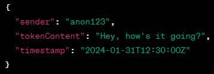

<h1>Вежба 8:</h1
               
**Модул за апликација за размена на пораки за пријателство**

- **Тежина: 7/10**

**Преглед:** Во ова вежба, имаатe задача да креиратe модул за нова апликација за размена  на пораки, дизајнирана да помогне на корисниците да запознаат нови пријатели. Апликацијата ја олеснува интеракција помеѓу два корисници, така што секој корисник има до 7 токени за разговор. Токен за разговор може да биде текстуална порака со 10 до 12 зборови или порака со слика. Редоследот во кој корисниците ќе ги потрошат своите токени за разговор е флексибилен.

Откако двајцата корисници ќе ги искористат своите 7 токени или во кој било момент пред тоа, кој било корисник може да го искористи свој "средбен" токен. Откако еден корисник ќе го искористи својот “средбен“ токен, другиот корисник мора исто така да го искористи својот средбен токен. Интеракцијата во овој момент го одредува исходот на разговорт:

1. Ако обата корисници пратат текст "meet", тие стануваат пријатели, ги откриваат своите вистински кориснички имиња. Разговорот станува заклучен и се става во таб-oт "Met a new Friend".
1. Ако главниот корисник прати " meet ", a другиот (meeter-от) прати "reject", корисничките имиња остануваат скриени, разговорот станува заклучен и се става во табот "Rejected".
1. Ако главниот корисник прати "reject", разговорот станува заклучен и се става во табот "Rejectee". Во овој случај, историјата на разговорот не се зачувува (не може да се прикаже) за главниот корисник, но се задржува на серверот од безбедносни причини.

Вашата главната задача е да креирате модул одговорен за вчитување на заклучените разговори кога корисниците се најавуваат од нов уред. На почеток добиваат JSON низа на заклучени разговори, каде што секој разговор е претставен со објект што содржи полиња како userID, meeterID, chatHistory (низа на токен објекти), username и meeterUsername. Секој токен објект содржи sender, tokenContent и timestamp.

Еве еден основен пример:

**Токен објектот** е клучен дел од низата **chatHistory**. Тој содржи информации за секој токен кој се разменил меѓу корисниците:

• **sender**: Претставува корисникот кој го испратил токенот. Во овој пример, е "anon123."

• **tokenContent**: Ја содржи  самата содржина на токенот. Тоа може да биде текстуална порака или URL за порака со слика.

• **timestamp**: Го наведува времето кога токенот бил испратен. Ова помага при сортирање на токените хронолошки.

**ЗАБЕЛЕШКА**: Во дадениот JSON, се користи поедноставен формат на timestamp.

За да се прикажат разговорите правилно, студентите прво треба да ја сортираат низата со токен објекти хронолошки и потоа да ги прикажат визуелно на страницата. HTML структурата за разговор веќе е обезбедена, па студентите треба да го имплементираат само динамичкото прикажување на историјата на разговорот.

Исходот на секој разговор, одредува како разговорот е прикажан и во кој таб е ставен. Ако исходот е позитивен, се користат вистинските кориснички имиња (username и meeterUsername). Ако е одбивање, се користат анонимни кориснички идентификациони имиња (userId и meeterId).

**Имплементација**:

1. **Вчитај и прикажи заклучени разговори:**

   • Употреби ја JSON низа на заклучени разговори, секој со информации за корисниците и токените.

   • За секој разговор, сортирај ја низата на токен објекти хронолошки, базирано на timestamp-от.

   • Динамички прикажи ја сортираната низа на разговор на страницата според обезбедената HTML структура.

1. **Логика за прикажување на таб-от:**

   • Одреди го соодветниот таб за секој разговор, базиран на исходот на последниот токен ("средбен" токен).

   • Ако исходот е " Met a new Friend ", користи ги вистинските кориснички имиња во приказот.

   • Ако исходот е "Rejected", користи анонимизирани ID-ови во приказот.

1. **Визуелно претставување:**

   • Имплементирај го динамичкото прикажување на разговорот со вистински или анонимизирани кориснички имиња во зависност од исходот.

   • Следете ја  обезбедената HTML структурата за прикажување на секој разговор.

**Дополнителни детали за корисничкиот интерфејс:**

• Табот " Met a new Friend " и " Rejected " приказуваат кликабилни кругови за секој разговор.

• Кликање на кругот во овие табови го отвора разговор во табот "Chat Info", правилно прикажан.

• Кругот во табот "Rejectee" не е кликабилен, што значи дека разговорот не е достапен за корисникот.

Примерен Сценарио:

Објаснување:

1. **Почетна Интеракција:**

   • JohnDoe (anon123) започнува разговор со поздрав.

   • JaneSmith (anon456) одговара и споделуваат некои заинтересираности.

1. **Предлог за Средба:**

   • JohnDoe и JaneSmith разменуваат уште шест токени, секој споделувајќи нешто повеќе за себе (вкупно 7 токени по корисник).

1. **Одлука за Средба:**

   • На 8-иот токен, JohnDoe праќа "meet".

   • JaneSmith, исто така, го испраќа својот 8-ми токен, одговарајќи со "meet".

1. **Исход:**

   • Историјата на разговорот покажува взаeмна одлука, каде JohnDoe и JaneSmith сакаат да станат пријатели.

   • Разговорот се категоризира според исходот и се става во соодветниот таб.

**Прикажување во корисничкиот интерфејс:**

• Во табот "Met a new Friend", се прикажува кликабилен круг.

• Под кругот, се поставува вистинското корисничко име ("JaneSmith") на новиот пријател, а во средина на кругот е првата буква од нејзиното име.

Fetch From:

**locked-chats**: https://raw.githubusercontent.com/Itonkdong/JSON/main/locked-chats.json

Слика 1. Успешно вчитани заклучени разговори во соодветните табови.

Слика 2. Успешно вчитана историја на еден разговор

<h1>Exercise 8:</h1>

**Friendship Messaging App Module**

- **Difficulty Level: 7/10**

**Overview:** In this exercise, students are tasked with creating a module for a new messaging app designed to help users meet new friends. The app facilitates interactions between two users, with each user having up to 7 chat tokens. A chat token can be a text message containing 10 to 12 words or a picture message. The order in which users consume their chat tokens is flexible.

After both users have spent their 7 tokens, or at any given point before that, any user can user his "meeting" token. After one user has used his meeting token, the other user must also use his meeting token. The interaction at this point determines the outcome:

1. If both users send the text "meet," they become friends, revealing their real usernames. The chat becomes locked and is placed in the "Met a New Friend" tab.
1. If the main user sends "meet" and the meeter sends "reject," the usernames remain unrevealed, the chat is locked, and it goes to the "Rejected" tab.
1. If the main user sends "reject," the chat becomes locked, and it goes into the "Rejectee" tab. In this case, the chat history is not saved (can not be displayed) for the main user, but it is retained on the server for safety.

The main task for the students is to build a module responsible for loading locked chats when users log in from a new device. They will receive a JSON array of locked chats, where each chat is represented by an object containing fields such as userID, meeterID, chatHistory (an array of token objects), username and meeterUsername. Each token object includes sender, tokenContent, and timestamp.

The JSON array consists of multiple chat objects, each representing a past interaction between two users. Here's a basic example:

The **tokenObject** is a key part of the **chatHistory** array. It contains information about each token exchanged between users:

- **sender**: Represents the user who sent the token. In this example, it's "anon123."
- **tokenContent**: Contains the actual content of the token. It could be a text message or a URL for a picture message.
- **timestamp**: Specifies when the token was sent. This helps in sorting the tokens chronologically.

**NOTE**: In the provided JSON, a simpler format of timestamp is used.

To display the chats correctly, students need to first sort the array of token objects chronologically and then present them visually on the page. The HTML structure for a chat is already provided, and students need to implement the dynamic rendering of the chat history.

The outcome of each chat, whether meeting new friends or rejection, determines how the chat is displayed and in which tab the chat head is placed. If the outcome is positive, real usernames are used. If it's a rejection, anonymous usernameIDs are employed. 

**Features to Implement:**

1. **Load and Display Locked Chats:**
   1. Fetch a JSON array of locked chats, each containing user and meeter IDs, chat history, and usernames.
   1. For each chat, sort the array of token objects chronologically based on the timestamp.
   1. Display the sorted chat history dynamically on the page according to the provided HTML structure.
1. **Tab Display Logic:**
   1. Determine the appropriate tab for each chat based on the last token's outcome ("meeting" token).
   1. If the outcome is "Met a new Friend," use the real usernames in the display.
   1. If the outcome is "Rejected" use anonymized IDs in the display.
1. **Visual Representation:**
   1. Implement the dynamic display of chat history with real or anonymized usernames based on the outcome.
   1. Follow the HTML structure provided for displaying each chat history.

**Additional UI Details:**

- The "Met a New Friend" and "Rejected" tabs display clickable circles for each chat.
- Clicking on a circle in these tabs opens the chat in the "Chat Info" tab, properly rendered.
- The circle in the "Rejectee" tab is non-clickable, representing that the chat is not available to the user.

Example Scenario:

Explanation:

1. **Initial Interaction:**
   1. JohnDoe (anon123) initiates the conversation with a greeting.
   1. JaneSmith (anon456) responds, and they share some interests.

1. **Proposal to Meet:**
   1. JohnDoe and JaneSmith exchange six more tokens each, sharing more about themselves (totaling 7 tokens per user).
1. **Decision to Meet:**
   1. On the 8th token, JohnDoe sends "meet".
   1. JaneSmith also sends her 8th token, responding with "meet".
1. **Outcome:**
   1. The **chatHistory** indicates a mutual decision, with both JohnDoe and JaneSmith wanting to become friends.
   1. The chat is categorized based on the outcome, and it is placed in the correct tab.

**UI Representation:**

**Met a New Friend Circle:**

- In the "Met a New Friend" tab, a clickable circle is displayed.
- Below the circle, the real username ("JaneSmith") of the new friend is placed and at the center of the cirle is the first letter of her name.

Fetch From:

**locked-chats**: https://raw.githubusercontent.com/Itonkdong/JSON/main/locked-chats.json
