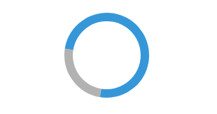
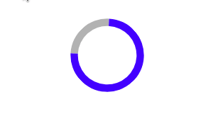

# Индикатор за вчутување

#### Тежина: <span style="color: green">Лесна</span>

Во оваа вежба ќе креирате индикатор за вчитување користејќи ја библиотеката anime.js.

Ќе создадете едноставен и ефективен индикатор кој ќе ги информира корисниците за тековниот статус на задачите. Следете ги упатствата и користете ги обезбедените ресурси и совети за да ја завршите вежбата.

Анимацијата треба да ги има следните карактеристики:

- Да се извршува во насока на стрелките на часовникот
- Должината да биде `1000` милисекунди
- Да се извршува во постојан циклус

### Почетен код

```html
<!doctype html>
<html lang="en">
  <head>
    <meta charset="UTF-8" />
    <meta name="viewport" content="width=device-width, initial-scale=1.0" />
    <title>Loading spinner</title>

    <script src="https://cdnjs.cloudflare.com/ajax/libs/animejs/3.2.2/anime.min.js"></script>

    <style>
      .spinner {
        width: 48px;
        height: 48px;
        border: 5px solid #3498db;
        border-bottom-color: rgba(0, 0, 0, 0.3);
        border-radius: 50%;
        display: inline-block;
        box-sizing: border-box;
      }
    </style>
  </head>

  <body>
    <div class="spinner"></div>
  </body>

  <script>
    // TODO: Implement loading spinner animation
  </script>
</html>
```

### Очекуван резултат


### Корисни ресурси и насоки

- [Anime.js transformations](https://animejs.com/documentation/#CSStransforms)
- [Anime.js easing functions](https://animejs.com/documentation/#easings)
- [Anime.js animation parameters](https://animejs.com/documentation/#animationParameters)

### Решение

```html
<!doctype html>
<html lang="en">
  <head>
    <meta charset="UTF-8" />
    <meta name="viewport" content="width=device-width, initial-scale=1.0" />
    <title>Loading spinner</title>

    <script src="https://cdnjs.cloudflare.com/ajax/libs/animejs/3.2.2/anime.min.js"></script>

    <style>
      .spinner {
        width: 48px;
        height: 48px;
        border: 5px solid #3498db;
        border-bottom-color: rgba(0, 0, 0, 0.3);
        border-radius: 50%;
        display: inline-block;
        box-sizing: border-box;
      }
    </style>
  </head>

  <body>
    <div id="spinner" class="spinner"></div>
  </body>

  <script>
    const spinner = document.getElementById("spinner");

    anime({
      targets: spinner,
      rotate: 360,
      easing: "linear",
      loop: true,
      duration: 1000,
    });
  </script>
</html>
```

## Дополнителни барања

### Барање 1: Анимирај во обратна насока

Во ова барање, ќе ја измените вашата анимација така што ќе се извршува во спротивна насока од стрелките на часовникот.



```js
anime({
  targets: spinner,
  rotate: 360,
  easing: "linear",
  loop: true,
  duration: 1000,
  direction: "reverse",
});
```

### Барање 2: Aнимирај промена на големина и боја

Во ова барање, ќе додадете анимација која ги менува големината и бојата на индикаторот за вчитување. Потребно е да се постигнат следните ефекти:

- Индикаторот треба да се ротира два пати за време на секој циклус од анимацијата
- Големината на индикаторот треба да се намалува на 85% од оригиналната големина и потоа да се зголеми назад на 100% за време на еден циклус
- Бојата на индикаторот треба да се менува во секој циклус. Промените треба да се во следниве бои: `црвена, зелена и сина`



```js
anime({
  targets: spinner,
  rotate: 2 * 360, // две завртувања
  scale: [1, 0.85, 1],
  easing: "linear",
  loop: true,
  duration: 2000, // 2 секунди
});

// Промена на бојата
// Втора анимација во исто време со различна должина
anime({
  targets: spinner,
  borderColor: ["#ff0000", "#00ff00", "#0000ff"],
  borderBottomColor: "rgba(0, 0, 0, 0.3)", // бојата на долната рамка ќе остане иста
  loop: true,
  duration: 6000,
});
```
