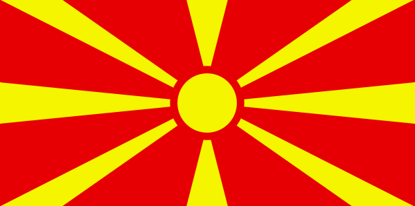

# Македонско знаме

#### Тежина: <span style="color: yellow">Средна</span>

Во оваа вежба, ќе креирате анимација за македонското знаме користејќи ја библиотеката anime.js.

Целта е да креирате анимација која ќе прикаже движење на зраците и сонцето на знамето. Следете ги упатствата и користете ги обезбедените ресурси и совети за да ја завршите вежбата.

Анимацијата треба да ги има следните карактеристики:

- Зраците треба да се појават еден по еден со забавување од `100` милисекунди.
- Анимацијата за еден зрак да трае `1000` милисекунди.
- Начинот на движење на анимацијата да биде синусоиден.

### Почетен код

```html
<!doctype html>
<html lang="en">
  <head>
    <meta charset="UTF-8" />
    <meta name="viewport" content="width=device-width, initial-scale=1.0" />
    <title>Macedonian flag</title>

    <script src="https://cdnjs.cloudflare.com/ajax/libs/animejs/3.2.2/anime.min.js"></script>

    <style>
      body {
        display: flex;
        justify-content: center;
        align-items: center;
        height: 100vh;
        margin: 0;
      }

      svg {
        overflow: hidden;
        width: 1200px;
        height: 600px;
      }
    </style>
  </head>

  <body>
    <svg width="1200" height="600" viewBox="-140 -70 280 140" fill="#f8e92e">
      <path fill="#d82126" d="m-140-70h280V70h-280z" />

      <path d="M -14 -70 L 14 -70 L 0 -15 L -14 -70 Z" />
      <path d="M 140 -70 L 98 -70 L -12.86 7.72 L 140 -70 Z" />
      <path d="M 0 0 L 140 14 L 140 -14" />
      <path d="M 140 70 L 98 70 L -12.86 -7.72 L 140 70 Z" />
      <path d="M 14 70 L -14 70 L 0 15 L 14 70 Z" />
      <path d="M -140 70 L -98 70 L 12.86 -7.72 L -140 70 Z" />
      <path d="M -140 14 L -140 -14 L 0 0 L -140 14" />
      <path d="M -140 -70 L -98 -70 L 12.86 7.72 L -140 -70 Z" />

      <circle r="22.5" stroke="#d82126" stroke-width="5" />
    </svg>
  </body>

  <script>
    // TODO: Add your code here
  </script>
</html>
```

### Очекуван резултат


### Корисни ресурси и насоки

### Решение

```html
<!doctype html>
<html lang="en">
  <head>
    <meta charset="UTF-8" />
    <meta name="viewport" content="width=device-width, initial-scale=1.0" />
    <title>Macedonian flag</title>

    <script src="https://cdnjs.cloudflare.com/ajax/libs/animejs/3.2.2/anime.min.js"></script>

    <style>
      body {
        display: flex;
        justify-content: center;
        align-items: center;
        height: 100vh;
        margin: 0;
      }

      svg {
        overflow: hidden;
        width: 1200px;
        height: 600px;
      }
    </style>
  </head>

  <body>
    <svg width="1200" height="600" viewBox="-140 -70 280 140" fill="#f8e92e">
      <path fill="#d82126" d="m-140-70h280V70h-280z" />

      <path class="zrak" d="M -14 -70 L 14 -70 L 0 -15 L -14 -70 Z" />
      <path class="zrak" d="M 140 -70 L 98 -70 L -12.86 7.72 L 140 -70 Z" />
      <path class="zrak" d="M 0 0 L 140 14 L 140 -14" />
      <path class="zrak" d="M 140 70 L 98 70 L -12.86 -7.72 L 140 70 Z" />
      <path class="zrak" d="M 14 70 L -14 70 L 0 15 L 14 70 Z" />
      <path class="zrak" d="M -140 70 L -98 70 L 12.86 -7.72 L -140 70 Z" />
      <path class="zrak" d="M -140 14 L -140 -14 L 0 0 L -140 14" />
      <path class="zrak" d="M -140 -70 L -98 -70 L 12.86 7.72 L -140 -70 Z" />

      <circle class="krug" r="22.5" stroke="#d82126" stroke-width="5" />
    </svg>
  </body>

  <script>
    const duration = 1000;

    anime({
      targets: ".zrak",
      scale: [0, 1],
      easing: "easeInOutSine",
      duration: duration,
      delay: anime.stagger(100),
    });
  </script>
</html>
```

## Дополнителни барања

### Барање 1: Прво исправените зраци, па дијагоналните

Во ова барање, целта е прво да ги анимирате исправените зраци на знамето, а потоа дијагоналните. Ова ќе создаде анимација во која зраците се појавуваат во две групи, со тоа што исправените зраци треба да се издолжат целосно пред да започнат дијагоналните.



```js
anime({
  targets: ".zrak",
  scale: [0, 1],
  easing: "easeInOutSine",
  duration: duration,
  delay: (el, i) => {
    if (i % 2 === 0) {
      return 0;
    } else {
      return duration;
    }
  },
});
```

### Барање 2: Секвенца на знамето

Ова барање вклучува креирање на секвенца за анимацијата на знамето. Секвенцата треба да содржи повеќе чекори.

> **Предлог:** Разгледајте ја можноста за користење на функцијата `anime.timeline` за да креирате комплексни секвенци на анимации.

Анимацијата треба да ја следи следната секвенца:

1. Сонцето треба да порасне до полна големина
2. Зраците треба да се издолжат еден по еден со забавување од `100` милисекунди
3. Зраците треба да се соберат еден по еден со забавување од `100` милисекунди
4. Сонцето треба да се намали додека го снема


```html
<circle class="krug" r="22.5" stroke="#d82126" stroke-width="5" />
```

```js
anime
  .timeline({
    duration: duration,
    easing: "easeInOutSine",
  })
  .add({
    targets: ".krug",
    scale: [0, 1],
  })
  .add({
    targets: ".zrak",
    delay: anime.stagger(100),
    scale: [0, 1],
  })
  .add({
    targets: ".zrak",
    delay: anime.stagger(100),
    scale: [1, 0],
  })
  .add({
    targets: ".krug",
    scale: [1, 0],
  });
```

### Барање 3: Комбинирај ги сите!

Ова барање ги комбинира сите претходни барања во една комплексна анимација. Еве што треба да се направи:

1. Направете сонцето да порасне до полна големина
2. Издолжете ги сите зраци со анимација со забавување
3. Соберете ги сите зраци со анимација со забавување
4. Издолжете ги зраците со групна анимација
5. Завртете ги зраците за 180 степени
6. Соберете ги зраците со групна анимација
7. Направето сонцето да се намали додека го снема

```js
anime
  .timeline({
    duration: duration,
    easing: "easeInOutSine",
  })
  .add({
    targets: ".krug",
    scale: [0, 1],
  })
  .add({
    targets: ".zrak",
    scale: [0, 1],
    delay: anime.stagger(100),
  })
  .add({
    targets: ".zrak",
    scale: [1, 0],
    delay: anime.stagger(100),
  })
  .add({
    targets: ".zrak",
    scale: [0, 1],
    delay: (el, i) => (i % 2 === 0 ? 0 : duration),
  })
  .add({
    targets: ".zrak",
    rotate: 180,
    easing: "linear",
  })
  .add({
    targets: ".zrak",
    scale: [1, 0],
    delay: (el, i) => (i % 2 === 0 ? 0 : duration),
  })
  .add({
    targets: ".krug",
    scale: [1, 0],
  });
```
