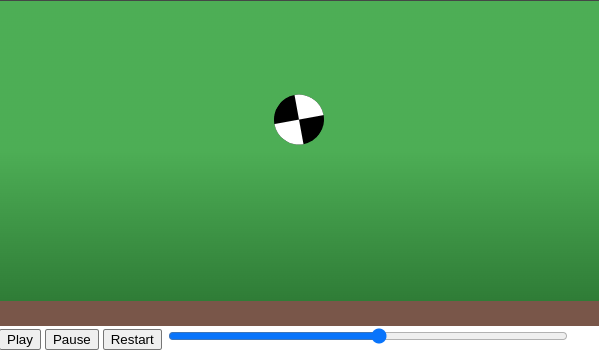

# Одскокнување на топка

#### Тежина: <span style="color: yellow">Средна</span>

Во оваа вежба, ќе креирате анимација на топка што одскокнува, користејќи ја библиотеката anime.js.

Следете ги упатствата и користете ги обезбедените ресурси и насоки за да ја завршите вежбата.

- Создадете фудбалско поле со зелена позадина и кафеава линија на дното.
- Додадете фудбалска топка на полето.

Анимацијата на топката треба да ги има следните карактеристики:

- Топката треба да одскокнува од долу нагоре и да се врати на почетната позиција.
- Топката треба да се врти за `3` пати во насока на часовникот.
- Должината да биде `1000` милисекунди.
- Начинот на движење на анимацијата да биде квадратен.
- Штом анимацијата заврши повторно да се изврши во обратна насока.
- Анимацијата да се извршува во постојан циклус.

### Почетен код

```html
<!doctype html>
<html lang="en">
  <head>
    <meta charset="UTF-8" />
    <meta name="viewport" content="width=device-width, initial-scale=1.0" />
    <title>Bouncing ball</title>

    <script src="https://cdnjs.cloudflare.com/ajax/libs/animejs/3.2.2/anime.min.js"></script>
  </head>
</html>
```

### Очекуван резултат


### Корисни ресурси и насоки

- [Anime.js easing functions](https://animejs.com/documentation/#easings)
- [Anime.js Timeline controls](https://animejs.com/documentation/#TLcontrols)

### Решение

```html
<!doctype html>
<html lang="en">
  <head>
    <meta charset="UTF-8" />
    <meta name="viewport" content="width=device-width, initial-scale=1.0" />
    <title>Bouncing ball</title>

    <script src="https://cdnjs.cloudflare.com/ajax/libs/animejs/3.2.2/anime.min.js"></script>

    <style>
      body {
        margin: 0;
      }

      #field {
        width: 600px;
        height: 300px;
        background: linear-gradient(to bottom, #4caf50, #4caf50, #2e7d32);
      }

      #ball {
        width: 0;
        box-sizing: border-box;
        border: 25px solid white;
        border-top-color: black;
        border-bottom-color: black;
        border-radius: 50%;
        margin: auto;
      }

      #ground {
        width: 600px;
        height: 25px;
        background: #795548;
      }
    </style>
  </head>

  <body>
    <div id="field">
      <div id="ball"></div>
    </div>
    <div id="ground"></div>
  </body>

  <script>
    anime({
      targets: "#ball",
      translateY: [250, 50],
      rotate: 360 * 3,
      easing: "easeOutQuad",
      loop: true,
      direction: "alternate",
    });
  </script>
</html>
```

## Дополнителни барања

### Барање 1: Контрола на анимацијата

За ова барање, треба да ги додадете контролите за анимацијата на топката. Додадете три копчиња: "Play", "Pause", "Restart", како и поле од тип `range` каде што ќе се прикаже моменталната состојба на анимацијата.

Да се имплементираат следните акции:

- При клик на "Play" треба да се пушти анимацијата.
- При клик на "Pause" треба да се паузира анимацијата.
- При клик на "Restart" треба да се рестартира анимацијата.
- При промена на вредноста на полето за контрола на анимацијата, треба да се постави вредноста на анимацијата која е избрана од страна на корисникот.



```html
<!doctype html>
<html lang="en">
  <head>
    <meta charset="UTF-8" />
    <meta name="viewport" content="width=device-width, initial-scale=1.0" />
    <title>Bouncing ball</title>

    <script src="https://cdnjs.cloudflare.com/ajax/libs/animejs/3.2.2/anime.min.js"></script>

    <style>
      body {
        margin: 0;
      }

      #field {
        width: 600px;
        height: 300px;
        background: linear-gradient(to bottom, #4caf50, #4caf50, #2e7d32);
      }

      #ball {
        width: 0;
        box-sizing: border-box;
        border: 25px solid white;
        border-top-color: black;
        border-bottom-color: black;
        border-radius: 50%;
        margin: auto;
      }

      #ground {
        width: 600px;
        height: 25px;
        background: #795548;
      }

      #progress {
        width: 400px;
      }
    </style>
  </head>

  <body>
    <div id="field">
      <div id="ball"></div>
    </div>
    <div id="ground"></div>

    <div>
      <button id="btnPlay">Play</button>
      <button id="btnPause">Pause</button>
      <button id="btnRestart">Restart</button>
      <input id="progress" type="range" />
    </div>
  </body>

  <script>
    const playButtonEl = document.getElementById("btnPlay");
    const pauseButtonEl = document.getElementById("btnPause");
    const restartButtonEl = document.getElementById("btnRestart");
    const seekProgressEl = document.getElementById("progress");

    const animation = anime({
      targets: "#ball",
      translateY: [250, 50],
      rotate: 360 * 3,
      easing: "easeOutQuad",
      loop: true,
      direction: "alternate",
      update: function (anim) {
        seekProgressEl.value = anim.progress;
      },
    });

    playButtonEl.addEventListener("click", () => animation.play());
    pauseButtonEl.addEventListener("click", () => animation.pause());
    restartButtonEl.addEventListener("click", () => animation.restart());

    seekProgressEl.addEventListener("input", function () {
      animation.reset();
      animation.seek(animation.duration * (seekProgressEl.value / 100));
    });

    seekProgressEl.addEventListener("change", function () {
      animation.play();
    });
  </script>
</html>
```
