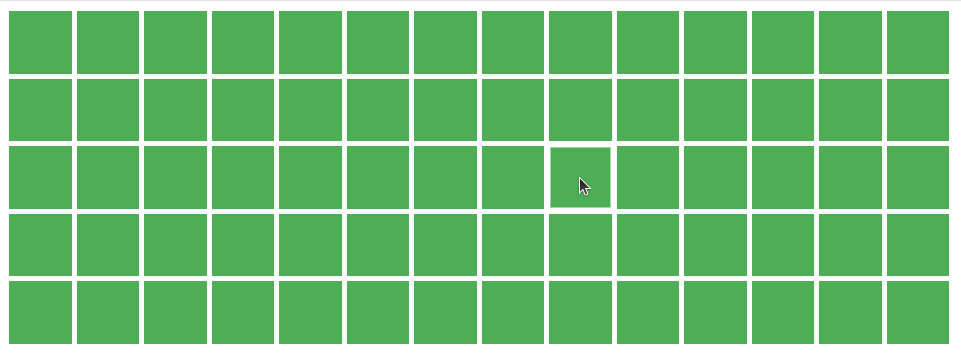
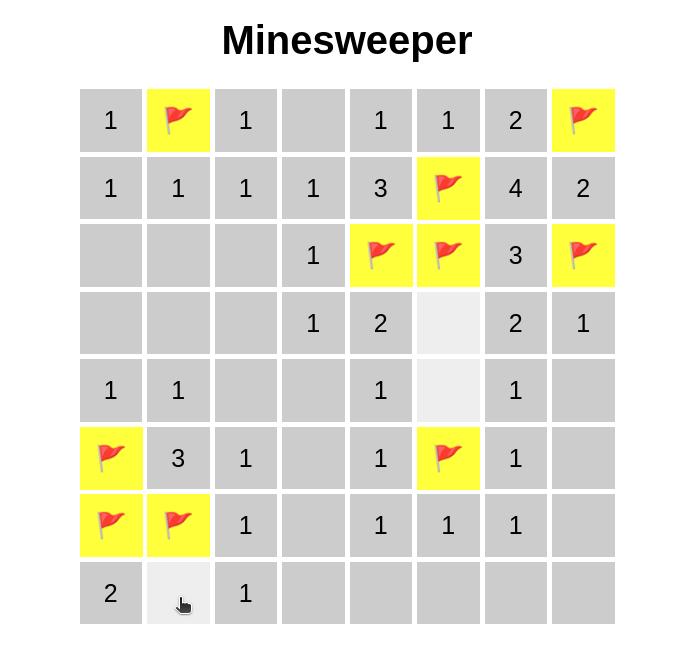

# Grid

#### Тежина: <span style="color: yellow">Средна</span>

Во оваа вежба, ќе креирате индикатор и состојба за вчитување користејќи ја библиотеката anime.js. Ќе дизајнирате визуелно привлечни и функционални индикатори кои обезбедуваат повратни информации до корисникот за напредокот на тековните задачи или процеси. Следете ги упатствата и користете ги обезбедените ресурси и совети за да ја завршите вежбата.

### Почетен код

```html
<!doctype html>
<html lang="en">
  <head>
    <meta charset="UTF-8" />
    <meta name="viewport" content="width=device-width, initial-scale=1.0" />
    <title>Grid</title>

    <script src="https://cdnjs.cloudflare.com/ajax/libs/animejs/3.2.2/anime.min.js"></script>
  </head>
</html>
```

### Очекуван резултат

При клик, квадратот треба да се анимира со следната анимација



При премин со глувчето над квадратот, квадратот треба да се анимира и да се намали со следната анимација.


### Корисни ресурси и насоки

- [Anime.js transformations](https://animejs.com/documentation/#CSStransforms)
- [Anime.js easing functions](https://animejs.com/documentation/#easings)
- [Anime.js animation parameters](https://animejs.com/documentation/#animationParameters)

### Решение

```html
<!doctype html>
<html lang="en">
  <head>
    <meta charset="UTF-8" />
    <meta name="viewport" content="width=device-width, initial-scale=1.0" />
    <title>Grid</title>

    <script src="https://cdnjs.cloudflare.com/ajax/libs/animejs/3.2.2/anime.min.js"></script>

    <style>
      .grid {
        display: grid;
        grid-template-columns: repeat(14, 50px);
        grid-template-rows: repeat(5, 50px);
        gap: 4px;
      }

      .square {
        background-color: #4caf50;
      }
    </style>
  </head>

  <body>
    <div class="grid"></div>
  </body>

  <script>
    const container = document.querySelector(".grid");

    for (let i = 0; i < 70; i++) {
      container.innerHTML += `<div id=${i} class="square"></div>`;
    }

    container.addEventListener("click", (e) => {
      if (!e.target.classList.contains("square")) return;

      // Find which square was clicked
      const id = e.target.id;

      anime({
        targets: ".square",
        scale: [
          { value: 0.1, easing: "easeOutSine", duration: 500 },
          { value: 1, easing: "easeInOutQuad", duration: 1200 },
        ],
        delay: anime.stagger(200, { grid: [14, 5], from: id }),
      });
    });

    container.addEventListener("mouseover", (e) => {
      if (!e.target.classList.contains("square")) return;

      anime({
        targets: e.target,
        scale: [
          { value: 0.1, easing: "easeOutSine", duration: 500 },
          { value: 1, easing: "easeInOutQuad", duration: 1200 },
        ],
      });
    });
  </script>
</html>
```

## Дополнителни барања

### Барање 1: Minesweeper игра

Анимација за означување на мина


Анимација за завршување на играта со експлозија


Анимација за завршување на играта со победа



```html
<!doctype html>
<html lang="en">
  <head>
    <meta charset="UTF-8" />
    <meta name="viewport" content="width=device-width, initial-scale=1.0" />
    <title>Minesweeper</title>

    <script src="https://cdnjs.cloudflare.com/ajax/libs/animejs/3.2.2/anime.min.js"></script>

    <style>
      body {
        font-family: Arial, sans-serif;
        text-align: center;

        display: flex;
        justify-content: center;
        align-items: center;
        height: 100vh;
        margin: 0;
        flex-direction: column;
      }

      .board {
        display: grid;
        grid-template-columns: repeat(8, 50px);
        grid-template-rows: repeat(8, 50px);
        gap: 4px;
      }

      .cell {
        text-align: center;
        vertical-align: middle;
        font-size: 20px;
        cursor: pointer;
        line-height: 50px;

        background-color: #eee;
        color: #333;
      }
    </style>
  </head>

  <body>
    <h1>Minesweeper</h1>
    <div class="board"></div>
  </body>

  <script>
    class MinesweeperGame {
      constructor(numRows, numCols, numMines) {
        this.numRows = numRows;
        this.numCols = numCols;
        this.numMines = numMines;

        this.gameBoardElement = document.querySelector(".board");

        this.board = [];
        this.canMakeMove = true;

        this.initializeBoard();
      }

      initializeBoard() {
        this.gameBoardElement.innerHTML = "";

        // Update grid layout to match the number of rows and columns
        this.gameBoardElement.style.gridTemplateColumns = `repeat(${this.numCols}, 50px)`;
        this.gameBoardElement.style.gridTemplateRows = `repeat(${this.numRows}, 50px)`;

        for (let i = 0; i < this.numRows; i++) {
          this.board[i] = [];
          for (let j = 0; j < this.numCols; j++) {
            const cell = document.createElement("div");

            cell.addEventListener("click", (e) => {
              this.revealCell(i, j);
            });

            cell.addEventListener("contextmenu", (e) => {
              e.preventDefault();
              this.markCell(i, j);
            });

            this.gameBoardElement.appendChild(cell);

            this.board[i][j] = {
              isMine: false,
              isRevealed: false,
              isMarked: false,
              element: cell,
              count: 0,
            };

            this.renderCell(this.board[i][j]);
          }
        }

        // Place mines randomly
        let minesPlaced = 0;
        while (minesPlaced < this.numMines) {
          const row = anime.random(0, this.numRows - 1);
          const col = anime.random(0, this.numCols - 1);

          if (!this.board[row][col].isMine) {
            this.board[row][col].isMine = true;
            this.board[row][col].count = undefined;

            // Update counts
            for (let dx = -1; dx <= 1; dx++) {
              for (let dy = -1; dy <= 1; dy++) {
                const neighborRow = row + dx;
                const neighborCol = col + dy;

                if (
                  this.isCellInBounds(neighborRow, neighborCol) &&
                  !this.board[neighborRow][neighborCol].isMine
                ) {
                  this.board[neighborRow][neighborCol].count++;
                }
              }
            }

            minesPlaced++;
          }
        }
      }

      isCellInBounds(row, col) {
        return row >= 0 && row < this.numRows && col >= 0 && col < this.numCols;
      }

      revealCell(row, col) {
        if (!this.isCellInBounds(row, col)) return;
        if (this.board[row][col].isRevealed) return;
        if (!this.canMakeMove) return;

        this.board[row][col].isRevealed = true;
        this.renderCell(this.board[row][col]);

        if (this.board[row][col].isMine) {
          this.gameOver(row, col);
        } else {
          // If cell has no mines nearby,
          // Reveal adjacent cells
          if (this.board[row][col].count === 0) {
            for (let dx = -1; dx <= 1; dx++) {
              for (let dy = -1; dy <= 1; dy++) {
                this.revealCell(row + dx, col + dy);
              }
            }
          }

          this.checkGameCompleted();
        }
      }

      markCell(row, col) {
        if (!this.isCellInBounds(row, col)) return;
        if (this.board[row][col].isRevealed) return;
        if (!this.canMakeMove) return;

        this.board[row][col].isMarked = !this.board[row][col].isMarked;

        anime({
          targets: this.board[row][col].element,
          backgroundColor: this.board[row][col].isMarked ? "#ff0" : "#eee",
          rotate: [
            { value: 30, easing: "easeOutSine", duration: 200 },
            { value: -30, easing: "easeInOutQuad", duration: 200 },
            { value: 0, easing: "easeInOutQuad", duration: 200 },
          ],
          begin: () => (this.canMakeMove = false),
          complete: () => (this.canMakeMove = true),
        });

        this.renderCell(this.board[row][col]);
      }

      checkGameCompleted() {
        const hasUnrevealedCells = this.board.some((row) =>
          row.some((cell) => !cell.isRevealed && !cell.isMine),
        );

        const isGameCompleted = !hasUnrevealedCells;
        if (isGameCompleted) {
          this.gameWon();
        }
      }

      gameWon() {
        this.canMakeMove = false;
        anime.remove(".cell");

        const mineCellElements = this.board
          .flat()
          .filter((cell) => cell.isMine)
          .map((cell) => cell.element);

        anime.set(mineCellElements, { innerHTML: "💣", zIndex: 2 });

        anime({
          targets: mineCellElements,
          backgroundColor: "#00ff00",
          duration: 1000,
        });
      }

      gameOver(row, col) {
        this.canMakeMove = false;
        // anime.remove(".cell");

        anime
          .timeline()
          .add({
            targets: this.board[row][col].element,
            scale: 1.5,
            duration: 250,
          })
          .add({
            targets: ".cell",
            scale: 0,
            easing: "easeOutSine",
            duration: 500,
            delay: anime.stagger(200, {
              grid: [this.numCols, this.numRows],
              from: row * this.numCols + col,
            }),
          });
      }

      renderCell(cellData) {
        const cell = cellData.element;
        cell.className = "cell";

        if (cellData.isRevealed) {
          cell.style.backgroundColor = "#ccc";
          cell.style.color = "#000";
          cell.textContent = "";

          if (cellData.isMine) {
            cell.style.backgroundColor = "#ff3333";
            cell.style.zIndex = "2";
            cell.textContent = "💣";
          } else if (cellData.count > 0) {
            cell.textContent = cellData.count;
          }
        } else if (cellData.isMarked) {
          cell.textContent = "🚩";
          cell.style.backgroundColor = "#ff0";
        } else {
          cell.textContent = "";
          cell.style.backgroundColor = "#eee";
        }
      }
    }

    const game = new MinesweeperGame(8, 8, 10);
  </script>
</html>
```
