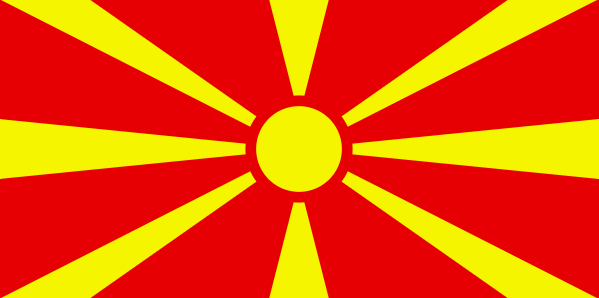

# Macedonian flag

#### Тежина: <span style="color: yellow">Средна</span>

Во оваа вежба, ќе креирате индикатор и состојба за вчитување користејќи ја библиотеката anime.js. Ќе дизајнирате визуелно привлечни и функционални индикатори кои обезбедуваат повратни информации до корисникот за напредокот на тековните задачи или процеси. Следете ги упатствата и користете ги обезбедените ресурси и совети за да ја завршите вежбата.

### Почетен код

```html
<!doctype html>
<html lang="en">
  <head>
    <meta charset="UTF-8" />
    <meta name="viewport" content="width=device-width, initial-scale=1.0" />
    <title>Macedonian flag</title>

    <script src="https://cdnjs.cloudflare.com/ajax/libs/animejs/3.2.2/anime.min.js"></script>

    <style>
      body {
        display: flex;
        justify-content: center;
        align-items: center;
        height: 100vh;
        margin: 0;
      }

      svg {
        overflow: hidden;
        width: 1200px;
        height: 600px;
      }
    </style>
  </head>

  <body>
    <svg width="1200" height="600" viewBox="-140 -70 280 140" fill="#f8e92e">
      <path fill="#d82126" d="m-140-70h280V70h-280z" />

      <path d="M -14 -70 L 14 -70 L 0 -15 L -14 -70 Z" />
      <path d="M 140 -70 L 98 -70 L -12.86 7.72 L 140 -70 Z" />
      <path d="M 0 0 L 140 14 L 140 -14" />
      <path d="M 140 70 L 98 70 L -12.86 -7.72 L 140 70 Z" />
      <path d="M 14 70 L -14 70 L 0 15 L 14 70 Z" />
      <path d="M -140 70 L -98 70 L 12.86 -7.72 L -140 70 Z" />
      <path d="M -140 14 L -140 -14 L 0 0 L -140 14" />
      <path d="M -140 -70 L -98 -70 L 12.86 7.72 L -140 -70 Z" />

      <circle r="22.5" stroke="#d82126" stroke-width="5" />
    </svg>
  </body>

  <script>
    // TODO: Add your code here
  </script>
</html>
```

### Очекуван резултат



### Корисни ресурси и насоки

### Решение

```html
<!doctype html>
<html lang="en">
  <head>
    <meta charset="UTF-8" />
    <meta name="viewport" content="width=device-width, initial-scale=1.0" />
    <title>Macedonian flag</title>

    <script src="https://cdnjs.cloudflare.com/ajax/libs/animejs/3.2.2/anime.min.js"></script>

    <style>
      body {
        display: flex;
        justify-content: center;
        align-items: center;
        height: 100vh;
        margin: 0;
      }

      svg {
        overflow: hidden;
        width: 1200px;
        height: 600px;
      }
    </style>
  </head>

  <body>
    <svg width="1200" height="600" viewBox="-140 -70 280 140" fill="#f8e92e">
      <path fill="#d82126" d="m-140-70h280V70h-280z" />

      <path class="zrak" d="M -14 -70 L 14 -70 L 0 -15 L -14 -70 Z" />
      <path class="zrak" d="M 140 -70 L 98 -70 L -12.86 7.72 L 140 -70 Z" />
      <path class="zrak" d="M 0 0 L 140 14 L 140 -14" />
      <path class="zrak" d="M 140 70 L 98 70 L -12.86 -7.72 L 140 70 Z" />
      <path class="zrak" d="M 14 70 L -14 70 L 0 15 L 14 70 Z" />
      <path class="zrak" d="M -140 70 L -98 70 L 12.86 -7.72 L -140 70 Z" />
      <path class="zrak" d="M -140 14 L -140 -14 L 0 0 L -140 14" />
      <path class="zrak" d="M -140 -70 L -98 -70 L 12.86 7.72 L -140 -70 Z" />

      <circle class="krug" r="22.5" stroke="#d82126" stroke-width="5" />
    </svg>
  </body>

  <script>
    const duration = 1000;

    anime({
      targets: ".zrak",
      scale: [0, 1],
      easing: "easeInOutSine",
      duration: duration,
      delay: anime.stagger(100),
    });
  </script>
</html>
```

## Дополнителни барања

### Even zraci first then the odd ones


```js
anime({
  targets: ".zrak",
  scale: [0, 1],
  easing: "easeInOutSine",
  duration: duration,
  delay: (el, i) => {
    if (i % 2 === 0) {
      return 0;
    } else {
      return duration;
    }
  },
});
```

### Flag timeline


```html
<circle class="krug" r="22.5" stroke="#d82126" stroke-width="5" />
```

```js
anime
  .timeline({
    duration: duration,
    easing: "easeInOutSine",
  })
  .add({
    targets: ".krug",
    scale: [0, 1],
  })
  .add({
    targets: ".zrak",
    delay: anime.stagger(100),
    scale: [0, 1],
  })
  .add({
    targets: ".zrak",
    delay: anime.stagger(100),
    scale: [1, 0],
  })
  .add({
    targets: ".krug",
    scale: [1, 0],
  });
```

### Now combine them all

- Make the circle grow to full size
- Extend all the rays with a stagger animation
- Retract all the rays with a stagger animation
- Extend the rays with a grouped animation
- Rotate the rays 180 degrees
- Retract the rays with a grouped animation
- Scale down the circle

```js
anime
  .timeline({
    duration: duration,
    easing: "easeInOutSine",
  })
  .add({
    targets: ".krug",
    scale: [0, 1],
  })
  .add({
    targets: ".zrak",
    scale: [0, 1],
    delay: anime.stagger(100),
  })
  .add({
    targets: ".zrak",
    scale: [1, 0],
    delay: anime.stagger(100),
  })
  .add({
    targets: ".zrak",
    scale: [0, 1],
    delay: (el, i) => (i % 2 === 0 ? 0 : duration),
  })
  .add({
    targets: ".zrak",
    rotate: 180,
    easing: "linear",
  })
  .add({
    targets: ".zrak",
    scale: [1, 0],
    delay: (el, i) => (i % 2 === 0 ? 0 : duration),
  })
  .add({
    targets: ".krug",
    scale: [1, 0],
  });
```
