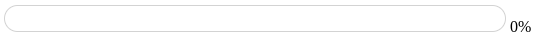
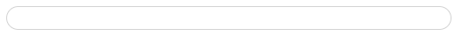
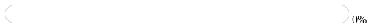

# Индикатор за напредок - Progress bar

#### Тежина: <span style="color: green">Лесна</span>

Во оваа вежба ќе креирате индикатор за напредок (Progress bar) користејќи ја библиотеката anime.js.

Да се креира индикатор за напредок кој ќе се пополнува со боја како што се зголемува вредноста на напредокот. Следете ги упатствата и користете ги обезбедените ресурси и совети за да ја завршите вежбата.

Анимацијата треба да ги има следните карактеристики:

- Напредокот да се движи од 0% до 100% ширина
- Прогрес барот да менува бои: од црвена, жолта, до зелена
- Текстот со проценти да одговара на напредокот на анимацијата
- Должината да биде `3000` милисекунди

### Почетен код

```html
<!doctype html>
<html lang="en">
  <head>
    <meta charset="UTF-8" />
    <meta name="viewport" content="width=device-width, initial-scale=1.0" />
    <title>Progress bar</title>

    <script src="https://cdnjs.cloudflare.com/ajax/libs/animejs/3.2.2/anime.min.js"></script>
  </head>

  <body>
    <!-- TODO: Add your code here -->
  </body>
</html>
```

### Очекуван резултат



### Корисни ресурси и насоки

### Решение

```html
<!doctype html>
<html lang="en">
  <head>
    <meta charset="UTF-8" />
    <meta name="viewport" content="width=device-width, initial-scale=1.0" />
    <title>Progress bar</title>

    <script src="https://cdnjs.cloudflare.com/ajax/libs/animejs/3.2.2/anime.min.js"></script>

    <style>
      .container {
        display: inline-block;
        width: 500px;
        height: 25px;
        border: 1px solid lightgray;
        border-radius: 25px;
        overflow: hidden;
      }

      #progress {
        width: 0%;
        height: 100%;
        background-color: #ff0000;
      }
    </style>
  </head>

  <body>
    <div class="container">
      <div id="progress"></div>
    </div>
    <span id="percentage">0%</span>
  </body>

  <script>
    const duration = 3000;

    anime({
      targets: "#progress",
      width: ["0%", "100%"],
      backgroundColor: ["#ff0000", "#ffff00", "#00ff00"],
      easing: "linear",
      duration: duration,
    });

    anime({
      targets: "#percentage",
      innerHTML: ["0%", "100%"],
      easing: "linear",
      round: 1,
      duration: duration,
    });
  </script>
</html>
```

## Дополнителни барања

### Барање 1: Користејки ја `update` методата

Во ова барање треба да ја користите update методата за да го ажурирате текстот со процентите во реално време додека прогрес барот се движи.

```js
anime({
  targets: "#progress",
  width: ["0%", "100%"],
  easing: "linear",
  duration: duration,
  update: function (anim) {
    const percentageElement = document.getElementById("percentage");
    percentageElement.textContent = Math.round(anim.progress) + "%";
  },
});
```

### Барање 2: Loading bar

Во ова барање треба да ја измените анимацијата каде што индикаторот за напредок (progress indicator) ќе го измените да функционира како индикатор за вчитување (loading indicator).

Анимацијата треба да ги има следните карактеристики:

- Индикаторот треба да се движи од лево кон десно
- Индикаторот треба да менува боја од сина (`#3498db`) во зелена (`#2ecc71`)
- Должината на анимацијата треба да биде `2500` милисекунди
- Анимацијата треба да се извршува во постојан циклус



```html
<style>
  #progress {
    width: 30%;
    height: 100%;
    background-color: #3498db;
    border-radius: 25px;
  }

  #percentage {
    display: none;
  }
</style>

<script>
  anime({
    targets: "#progress",
    translateX: [-250, 500],
    backgroundColor: ["#3498db", "#2ecc71"],
    easing: "linear",
    duration: 2500,
    loop: true,
  });
</script>
```

### Барање 3: Визуелни шари користејќи CSS градиенти

Во ова барање треба да додадете визуелни шари (patterns) на индикаторот за напредок користејќи CSS градиенти. Имплементирајте ги градиентите `Parallel` и `Zig Zag` од следниот линк.

[Css градиенти - https://cssgradient.io/blog/gradient-patterns/](https://cssgradient.io/blog/gradient-patterns/)

#### Градиент Parallel


```html
<style>
  #progress {
    width: 0%;
    height: 100%;
    background-color: #00ccd6;
    background-image: linear-gradient(
      90deg,
      transparent 50%,
      rgba(255, 255, 255, 0.5) 50%
    );
    background-size: 25px 25px;
  }
</style>
```

---

#### Градиент Zig Zag



```html
<style>
  #progress {
    width: 0%;
    height: 100%;
    background-color: #ec173a;
    background:
      linear-gradient(135deg, #eceddc 25%, transparent 25%) -12.5px 0,
      linear-gradient(225deg, #eceddc 25%, transparent 25%) -12.5px 0,
      linear-gradient(315deg, #eceddc 25%, transparent 25%),
      linear-gradient(45deg, #eceddc 25%, transparent 25%);
    background-size: 25px 25px;
  }
</style>
```
