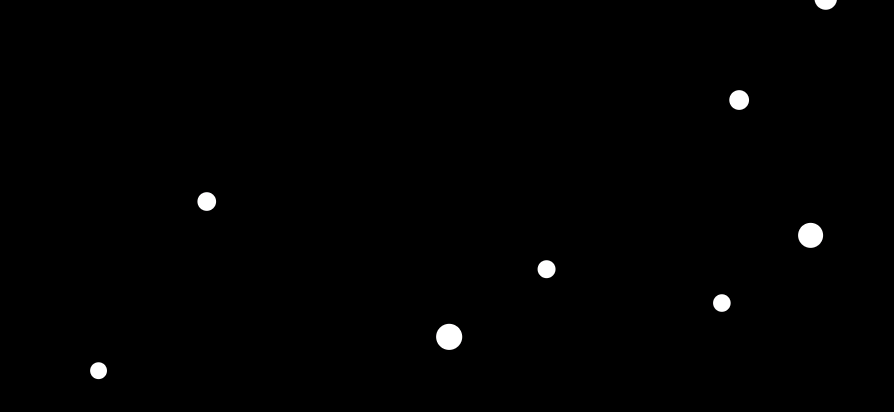

# Snow effect

#### Тежина: <span style="color: yellow">Средна</span>

Во оваа вежба, ќе креирате индикатор и состојба за вчитување користејќи ја библиотеката anime.js. Ќе дизајнирате визуелно привлечни и функционални индикатори кои обезбедуваат повратни информации до корисникот за напредокот на тековните задачи или процеси. Следете ги упатствата и користете ги обезбедените ресурси и совети за да ја завршите вежбата.

### Почетен код

```html
<!doctype html>
<html lang="en">
  <head>
    <meta charset="UTF-8" />
    <meta name="viewport" content="width=device-width, initial-scale=1.0" />
    <title>Snow effect</title>

    <script src="https://cdnjs.cloudflare.com/ajax/libs/animejs/3.2.2/anime.min.js"></script>

    <style>
      body {
        background-color: #000;
        overflow: hidden;
      }

      .snegulka {
        position: absolute;
        width: 10px;
        height: 10px;
        background-color: #fff;
        border-radius: 50%;
      }
    </style>
  </head>

  <body>
    <div id="snegulki"></div>
  </body>

  <script>
    // TODO: Add your code here
  </script>
</html>
```

### Очекуван резултат



### Корисни ресурси и насоки

### Решение

```html
<!doctype html>
<html lang="en">
  <head>
    <meta charset="UTF-8" />
    <meta name="viewport" content="width=device-width, initial-scale=1.0" />
    <title>Snow effect</title>

    <script src="https://cdnjs.cloudflare.com/ajax/libs/animejs/3.2.2/anime.min.js"></script>

    <style>
      body {
        background-color: #000;
        overflow: hidden;
      }

      .snegulka {
        position: absolute;
        width: 10px;
        height: 10px;
        background-color: #fff;
        border-radius: 50%;
      }
    </style>
  </head>

  <body>
    <div id="snegulki"></div>
  </body>

  <script>
    const container = document.getElementById("snegulki");

    for (let i = 0; i < 250; i++) {
      const snegulka = document.createElement("div");
      snegulka.classList.add("snegulka");
      container.appendChild(snegulka);

      snegulka.style.left = anime.random(0, window.innerWidth) + "px";
    }

    anime({
      targets: ".snegulka",
      translateY: [-50, window.innerHeight],
      scale: () => anime.random(0.5, 1.5),
      easing: "linear",
      duration: 3000,
      delay: (el, i) => i * 100,
      loop: true,
    });
  </script>
</html>
```
