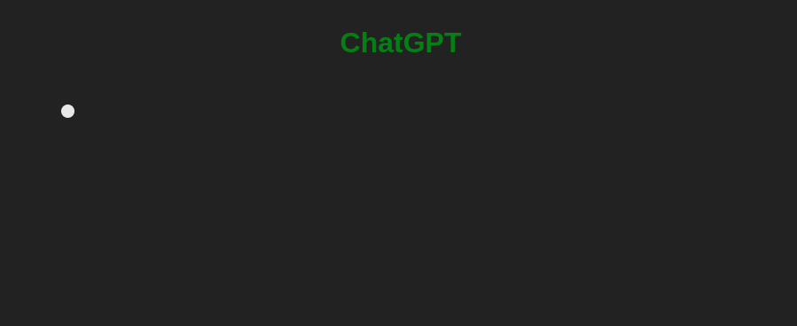

# Typewriter

#### Тежина: <span style="color: orange">Напредна</span>

Во оваа вежба, ќе креирате индикатор и состојба за вчитување користејќи ја библиотеката anime.js. Ќе дизајнирате визуелно привлечни и функционални индикатори кои обезбедуваат повратни информации до корисникот за напредокот на тековните задачи или процеси. Следете ги упатствата и користете ги обезбедените ресурси и совети за да ја завршите вежбата.

### Почетен код

```html
<!doctype html>
<html lang="en">
  <head>
    <meta charset="UTF-8" />
    <meta name="viewport" content="width=device-width, initial-scale=1.0" />
    <title>Typewriter</title>

    <script src="https://cdnjs.cloudflare.com/ajax/libs/animejs/3.2.2/anime.min.js"></script>
  </head>
</html>
```

### Очекуван резултат


### Корисни ресурси и насоки

- [Anime.js object transformations](https://animejs.com/documentation/#JSobjProp)

### Решение

```html
<!doctype html>
<html lang="en">
  <head>
    <meta charset="UTF-8" />
    <meta name="viewport" content="width=device-width, initial-scale=1.0" />
    <title>Typewriter</title>

    <script src="https://cdnjs.cloudflare.com/ajax/libs/animejs/3.2.2/anime.min.js"></script>

    <style>
      body {
        display: flex;
        flex-direction: column;
        justify-content: center;
        gap: 1rem;
        text-align: center;
        background-color: #000;
        color: #fff;
        font-family: monospace;
        margin: 0;
        padding: 2rem;
        height: 100vh;
        box-sizing: border-box;
      }

      #typewriter {
        font-size: 24px;
      }
    </style>
  </head>

  <body>
    <div id="typewriter"></div>
  </body>

  <script>
    const textEl = document.getElementById("typewriter");
    const text = "Интернет Програмирање на Клиентска Страна";

    anime({
      targets: { count: 0 },
      count: [0, text.length],
      round: 1,
      easing: "linear",
      duration: 4000,
      update: function (anim) {
        const numCharacters = Math.round(anim.animations[0].currentValue);
        textEl.innerHTML = text.substring(0, numCharacters);
      },
      complete: function () {
        anime({
          targets: textEl,
          color: "#00cc00",
          duration: 1000,
          easing: "linear",
        });
      },
    });
  </script>
</html>
```

## Дополнителни барања

### Ажурирање со актуелни податоци

`https://api.quotable.io/random`


```html
<!doctype html>
<html lang="en">
  <head>
    <meta charset="UTF-8" />
    <meta name="viewport" content="width=device-width, initial-scale=1.0" />
    <title>Typewriter</title>

    <script src="https://cdnjs.cloudflare.com/ajax/libs/animejs/3.2.2/anime.min.js"></script>

    <style>
      body {
        background-color: #000;
        color: #fff;
        font-family: monospace;
        display: flex;
        flex-direction: column;
        gap: 1rem;
        justify-content: center;
        align-items: center;
        text-align: center;
        margin: 0;
        padding: 2rem;
        height: 100vh;
        box-sizing: border-box;
      }

      #typewriter {
        font-size: 24px;
      }

      #btnNewQuote {
        padding: 8px 16px;
        opacity: 1;
        background: black;
        border: 1px solid gray;
        color: gray;
        cursor: pointer;
        font-size: 12px;
      }
    </style>
  </head>

  <body>
    <div id="typewriter"></div>

    <button id="btnNewQuote">Show another quote</button>
  </body>

  <script>
    const textEl = document.getElementById("typewriter");
    const btnNewQuote = document.getElementById("btnNewQuote");

    function showNewQuote() {
      // Ги стопираме старите анимации доколку се активни
      anime.remove([textEl, btnNewQuote]);

      // Го празниме полето за текст
      textEl.innerHTML = "";

      // Го криеме и оневозможуваме копчето за нов цитат
      btnNewQuote.style.opacity = 0;
      btnNewQuote.disabled = true;

      // Правиме повик за нов рандом цитат од API-то за цитати
      fetch("https://api.quotable.io/random")
        .then((response) => response.json())
        .then((data) => {
          const quote = data.content + " - " + data.author;

          anime({
            targets: { count: 0 },
            count: [0, quote.length],
            round: 1,
            easing: "linear",
            duration: 4000,
            update: function (anim) {
              const numCharacters = anim.animations[0].currentValue;
              textEl.innerHTML = quote.substring(0, numCharacters);
            },
            complete: function () {
              btnNewQuote.disabled = false;

              anime({
                targets: btnNewQuote,
                opacity: 1,
                easing: "linear",
                duration: 1000,
              });
            },
          });
        })
        .catch(() => {
          textEl.innerHTML = "Unexpected error occurred";
        });
    }

    btnNewQuote.addEventListener("click", showNewQuote);

    showNewQuote();
  </script>
</html>
```

### ChatGPT



```html
<!doctype html>
<html lang="en">
  <head>
    <meta charset="UTF-8" />
    <meta name="viewport" content="width=device-width, initial-scale=1.0" />
    <title>Chat GPT</title>

    <script src="https://cdnjs.cloudflare.com/ajax/libs/animejs/3.2.2/anime.min.js"></script>

    <style>
      body {
        font-family: sans-serif;
        background: #222;
        margin: 0;
        padding: 50px 300px;
      }

      h1 {
        color: green;
        text-align: center;
        margin-bottom: 3rem;
      }

      .text-animation {
        color: white;
        font-size: 20px;
      }

      .cursor {
        display: inline-block;
        background: white;
        height: 15px;
        width: 15px;
        border-radius: 50%;
      }
    </style>
  </head>

  <body>
    <h1>ChatGPT</h1>
    <div id="container"></div>
  </body>

  <script>
    const container = document.getElementById("container");

    const contents = [
      `Lorem ipsum dolor sit amet consectetur adipisicing elit. Incidunt dolorem, quae dolor molestias magnam labore. reprehenderit alias asperiores dignissimos quo officiis, unde in! Nostrum ipsa at, suscipit eum soluta harum.`,

      `Hic tenetur numquam odio! Modi explicabo, fuga, iusto unde nihil corporis officia repellendus ab magni necessitatibus hic iure repellat accusamus officiis molestiae consequuntur vero incidunt quo. Amet unde architecto facere praesentium quaerat voluptate reiciendis.`,
    ];

    const TYPE_AFTER_MS = 2000;
    const LETTERS_PER_SECOND = 50; // брзина - букви во секунда

    function typeContent(index) {
      const content = contents[index];

      if (!content) {
        return;
      }

      const textEl = document.createElement("span");
      textEl.classList.add("text-animation");
      container.appendChild(textEl);

      const cursorEl = document.createElement("span");
      cursorEl.classList.add("cursor");
      container.appendChild(cursorEl);

      const blinkAnimation = anime({
        targets: cursorEl,
        loop: true,
        duration: 500,
        opacity: [1, 0],
        easing: "linear",
        direction: "alternate",
      });

      const duration = (content.length / LETTERS_PER_SECOND) * 1000;
      const delay = index === 0 ? TYPE_AFTER_MS : 0;

      anime({
        targets: { count: 0 },
        count: [0, content.length],
        round: 1,
        easing: "linear",
        duration: duration,
        delay: delay,
        changeBegin: function () {
          blinkAnimation.pause();
          anime.set(cursorEl, { opacity: 1 });
        },
        update: function (anim) {
          const numCharacters = Math.round(anim.animations[0].currentValue);
          textEl.innerHTML = content.substring(0, numCharacters);
        },
        complete: function () {
          cursorEl.remove();
          container.innerHTML += "<br><br>";
          typeContent(index + 1);
        },
      });
    }

    typeContent(0);
  </script>
</html>
```
