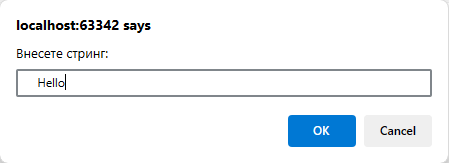
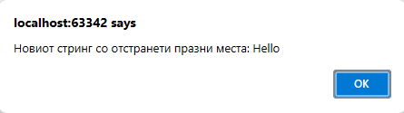

# Задача 11

Напишете програма што ги отстранува сите празни места од почетокот и крајот на стринг кој се внесува од тастатура.





# Решение

```html
<!doctype html>
<html lang="en">
  <head> </head>
  <body>
    <script>
      let str = prompt("Внесете стринг:");
      alert("Новиот стринг со отстранети празни места: " + str.trim());
    </script>
  </body>
</html>
```
