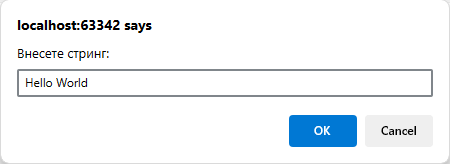
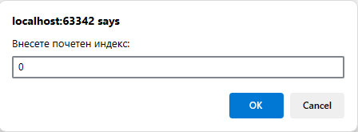
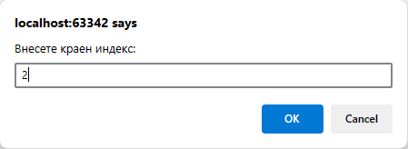
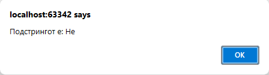

# Задача 12

Напишете програма што печати подстринг од даден стринг, почнувајќи од индекс x до индекс y.









# Решение

```html
<!doctype html>
<html lang="en">
  <head>
    <meta charset="UTF-8" />
  </head>
  <body>
    <script>
      var str = prompt("Внесете стринг:");
      var x = parseInt(prompt("Внесете почетен индекс:"));
      var y = parseInt(prompt("Внесете краен индекс:"));
      alert("Подстрингот е: " + str.substring(x, y));
    </script>
  </body>
</html>
```
