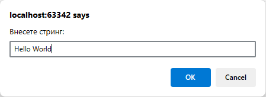
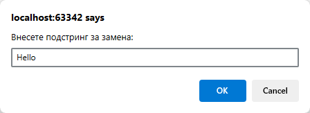
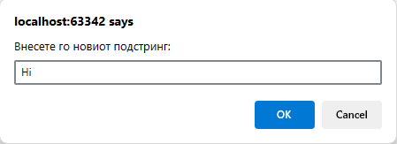
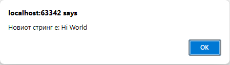

# Задача 13

Напишете програма што го заменува првото појавување на подстринг a со подстринг b во даден стринг.









# Решение

```html
<!doctype html>
<html lang="en">
  <head>
    <meta charset="UTF-8" />
  </head>
  <body>
    <script>
      let str = prompt("Внесете стринг:");
      let a = prompt("Внесете подстринг за замена:");
      let b = prompt("Внесете го новиот подстринг:");
      alert("Новиот стринг е: " + str.replace(a, b));
    </script>
  </body>
</html>
```
