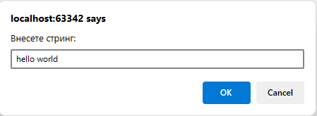
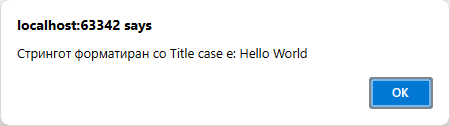

# Задача 14

Напишете програма која прима стринг со текст и го претвора во "Title Case" (секој збор започнува со голема буква).





# Решение

```html
<!doctype html>
<html lang="en">
  <head>
    <meta charset="UTF-8" />
  </head>
  <body>
    <script>
      var str = prompt("Внесете стринг:").toLowerCase().split(" ");
      for (var i = 0; i < str.length; i++) {
        str[i] = str[i].charAt(0).toUpperCase() + str[i].slice(1);
      }
      alert("Стрингот форматиран со Title case е: " + str.join(" "));
    </script>
  </body>
</html>
```
