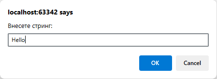
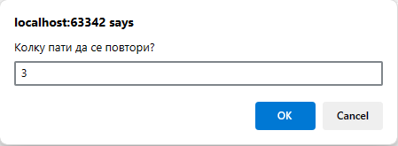
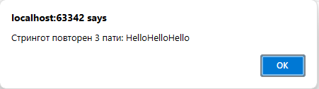

# Задача 15

Напишете програма која прима стринг и го повторува x пати, каде x е број зададен од корисникот







# Решение

```html
<!doctype html>
<html lang="en">
  <head>
    <meta charset="UTF-8" />
  </head>
  <body>
    <script>
      var str = prompt("Внесете стринг:");
      var times = parseInt(prompt("Колку пати да се повтори?"));
      alert("Стрингот повторен " + times + " пати: " + str.repeat(times));
    </script>
  </body>
</html>
```
