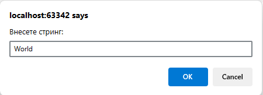
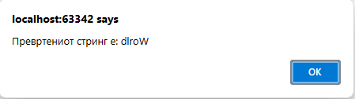

# Задача 16

Напишете програма што го превртува даден стринг (на пример, од 'hello' да направи 'olleh').





# Решение

```html
<!doctype html>
<html lang="en">
  <head>
    <meta charset="UTF-8" />
  </head>
  <body>
    <script>
      var str = prompt("Внесете стринг:");
      alert("Превртениот стринг е: " + str.split("").reverse().join(""));
    </script>
  </body>
</html>
```
