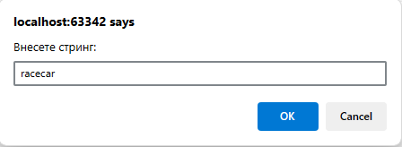
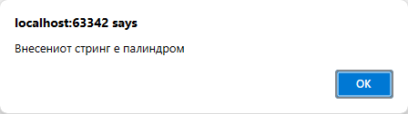

# Задача 17

Напишете програма што проверува дали даден стринг е палиндром (се чита исто напред и назад).





# Решение

```html
<!doctype html>
<html lang="en">
  <head>
    <meta charset="UTF-8" />
  </head>
  <body>
    <script>
      var str = prompt("Внесете стринг:");
      var reversed = str.split("").reverse().join("");
      if (str === reversed) {
        alert("Внесениот стринг е палиндром");
      } else {
        alert("Внесениот стринг НЕ е палиндром");
      }
    </script>
  </body>
</html>
```
