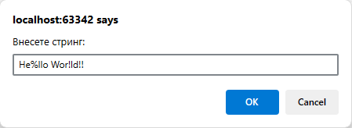
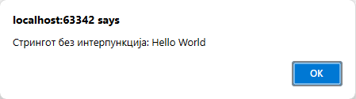

# Задача 18

Напишете програма која прима стринг и враќа верзија на истиот стринг без интерпункција.





# Решение

```html
<!doctype html>
<html lang="en">
  <head>
    <meta charset="UTF-8" />
  </head>
  <body>
    <script>
      let str = prompt("Внесете стринг:");
      alert(
        "Стрингот без интерпункција: " +
          str.replace(/[.,\/#!$%\^&\*;:{}=\-_`~()]/g, ""),
      );
    </script>
  </body>
</html>
```
