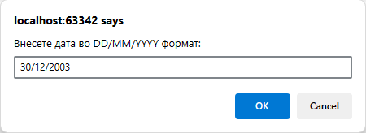
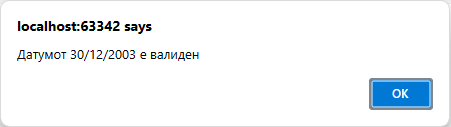

# Задача 19

Напишете програма што проверува дали даден стринг е валидна датумска ознака во форматот DD/MM/YYYY.





# Решение

```html
<!doctype html>
<html lang="en">
  <head>
    <meta charset="UTF-8" />
  </head>
  <body>
    <script>
      var dateString = prompt("Внесете дата во DD/MM/YYYY формат:");
      var regex =
        /^(3[01]|[12][0-9]|0?[1-9])(\/|-)(1[0-2]|0?[1-9])\2([0-9]{2})?[0-9]{2}$/;
      if (regex.test(dateString)) {
        alert("Датумот " + dateString + " е валиден");
      } else {
        alert("Датумот " + dateString + " НЕ е валиден");
      }
    </script>
  </body>
</html>
```
