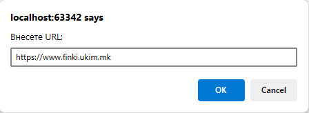
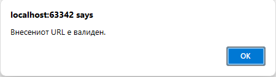

# Задача 20

Напишете програма за валидација на URL што проверува дали стрингот почнува со "http://" или "https://" и завршува на ".com", ".mk", ".gov", ".edu" или ".net".





# Решение

```html
<!doctype html>
<html lang="en">
  <head>
    <meta charset="UTF-8" />
  </head>
  <body>
    <script>
      var urlString = prompt("Внесете URL:");

      if (
        (urlString.startsWith("http://") || urlString.startsWith("https://")) &&
        (urlString.endsWith(".com") ||
          urlString.endsWith(".mk") ||
          urlString.endsWith(".gov") ||
          urlString.endsWith(".edu") ||
          urlString.endsWith(".net"))
      ) {
        alert("Внесениот URL е валиден.");
      } else {
        alert("Внесениот URL НЕ е валиден.");
      }
    </script>
  </body>
</html>
```
